# 1.研究背景
对本车前方车辆的识别及距离检测是计算机视觉技术在智能网联汽车中的一个重要内容。要想在错综繁杂的交通环境中实现无人驾驶，对行车环境中其他车辆信息的获取是十分重要的。因此，对本车前方车辆的识别及距离检测是智能网联汽车研发和应用过程中必不可少的一个重要技术基础。该系统主要通过摄像头采集前方的道路环境，识别出前方行车环境中的车辆并计算出本车与前方车辆的距离，并将识别结果和测距结果显示在屏幕上，能警示驾驶员及时调整好车速，能够有效避免碰撞事故的发生，减轻车祸中人员伤亡情况和带来的经济财产损失。另外，对本车前方车辆的识别及距离检测也是自动驾驶技术的一个重要技术基础，对其的研究有助于传统汽车产业的变革创新，有助于自动驾驶技术的完善，有助于推动智能网联汽车产业化进程，有助于我国建立成为一个智能网联汽车强国。


# 2.图片演示
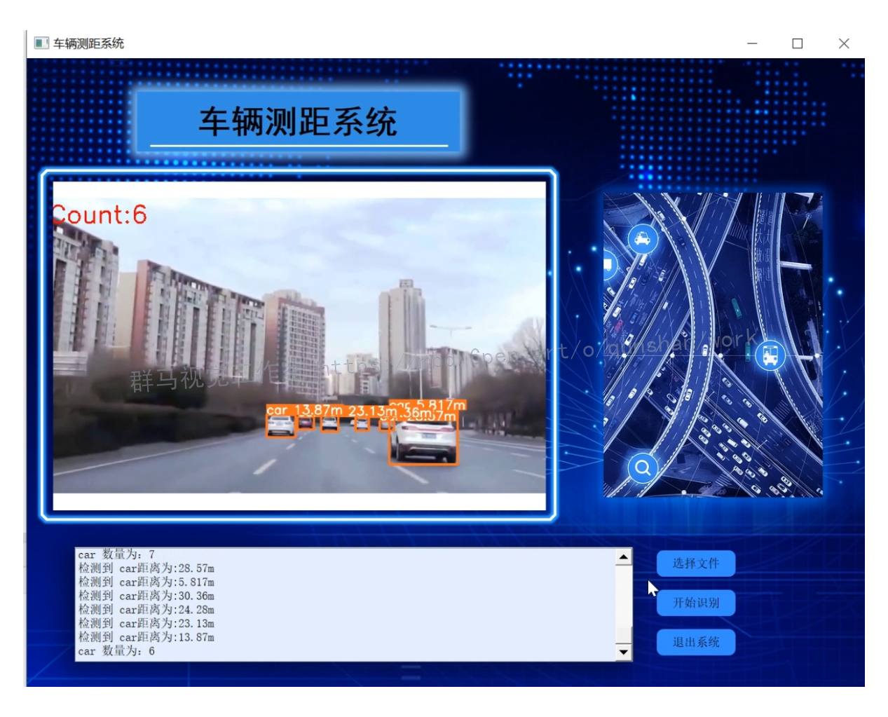

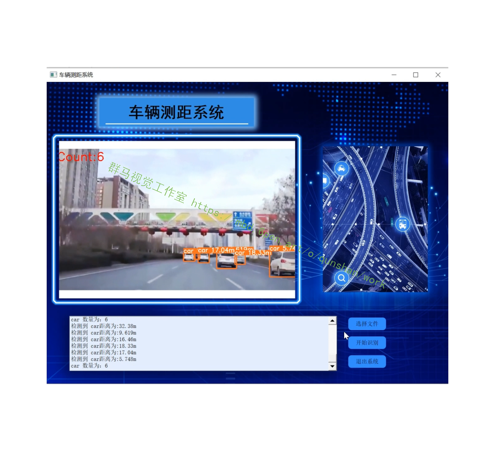

# 3.视频演示
[基于Opencv的车距检测系统（源码＆教程）_哔哩哔哩_bilibili](https://www.bilibili.com/video/BV1BD4y11765/?vd_source=bc9aec86d164b67a7004b996143742dc)


# 4.系统原理图
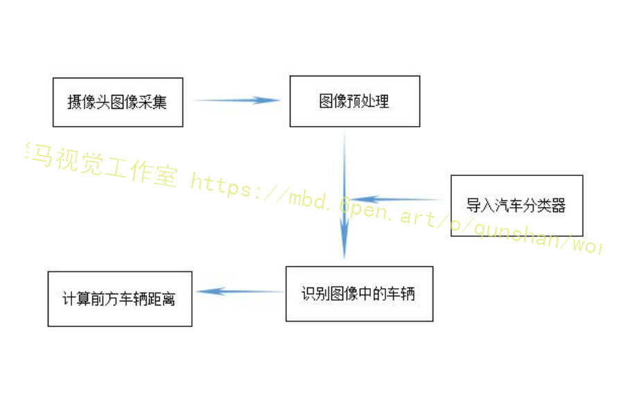

# 5.车辆识别分类器的设计
#### Adaboost 级联分类器
在对输入的图像通过积分图计算出多个矩形特征值之后，应用Adaboost算法从中选择出组合到一块可以更好的区分出车辆和非车辆的矩形特征。[采用该博客提出的的训练算法](https://mbd.pub/o/bread/Y5iYl5Zx)是应用Adaboost的。Adaboost是一种迭代算法，其主要原理是将针对一个训练集训练出来不同的弱分类器级联起来形成一个更强的最终分类器。其具体的算法流程图如图所示，总的来说，整个Adaboost迭代算法可分为3步:
1、对将要进行训练的数据的权值进行初始化。假设样本总数为n，那么1/n便为每一个样本的权值。
2、训练弱分类器。在训练的过程中，每个样本点在下一个训练集的权值的变化与该样本是否被正确分类息息相关，若分类准确，则该样本点在下一个训练集的权值就会减小，最后将权值变化后的样本作为训练新的一个分类器的数据，如此迭代直到训练结束。
3、级联各个若分类器形成一个更强的最终分类器。训练结束以后，将得到的分类误差率相对较小的弱分类器的权值增大，以升高该分类器在最终分类器所占的比重。这样最终分类器的分类准确性才会相对提高。
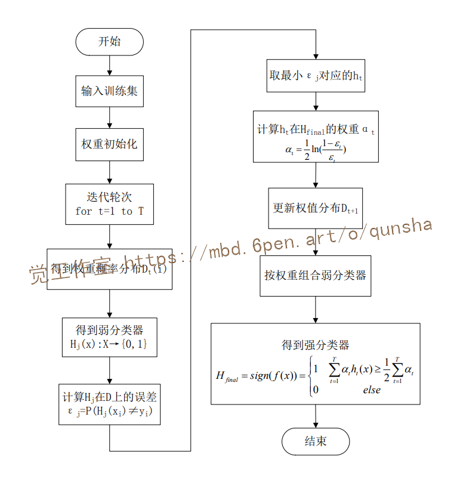
#### 代码实现
```
class DecisionTreeClassifierWithWeight:
    def __init__(self):
        self.best_err = 1  # 最小的加权错误率
        self.best_fea_id = 0  # 最优特征id
        self.best_thres = 0  # 选定特征的最优阈值
        self.best_op = 1  # 阈值符号，其中 1: >, 0: <
 
    def fit(self, X, y, sample_weight=None):
        if sample_weight is None:
            sample_weight = np.ones(len(X)) / len(X)
        n = X.shape[1]
        for i in range(n):
            feature = X[:, i]  # 选定特征列
            fea_unique = np.sort(np.unique(feature))  # 将所有特征值从小到大排序
            for j in range(len(fea_unique)-1):
                thres = (fea_unique[j] + fea_unique[j+1]) / 2  # 逐一设定可能阈值
                for op in (0, 1):
                    y_ = 2*(feature >= thres)-1 if op==1 else 2*(feature < thres)-1  # 判断何种符号为最优
                    err = np.sum((y_ != y)*sample_weight)
                    if err < self.best_err:  # 当前参数组合可以获得更低错误率，更新最优参数
                        self.best_err = err
                        self.best_op = op
                        self.best_fea_id = i
                        self.best_thres = thres
        return self
    
    def predict(self, X):
        feature = X[:, self.best_fea_id]
        return 2*(feature >= self.best_thres)-1 if self.best_op==1 else 2*(feature < self.best_thres)-1
    
    def score(self, X, y, sample_weight=None):
        y_pre = self.predict(X)
        if sample_weight is not None:
            return np.sum((y_pre == y)*sample_weight)
        return np.mean(y_pre == y)
```


# 6.OpenCV 中分类器的训练

#### 将训练用的正负样本图像进行预处理
收集完正负样本之后，需要调用OpenCV的相关函数对样本图片进行归一化处理，将所有的正样本图像调整为20*20(OpenCV推荐训练样本的最佳尺寸是（20x20),对于负样本没有样本尺寸要求，只要不小于正样本的大小即可;对样本图像，除了归一化处理之外还需对所有样本图片其进行灰度化，以减少训练时占用的内存空间。应用OpenCV进行图像处理时，若只对一幅图片做归一化和灰度化处理其实会很简单，只需读入一张图片再调用相关函数即可。但正负样本两个文件夹，里面存着成百上千张文件名不规则的图片，关键在于如何一次性对文件夹里的所有无规律排列的图片进行图像处理。
本文在采用[该博客提出的FindFile()函数](https://afdian.net/item?plan_id=2c8195905be611eda64452540025c377)，编程设计了一个小程序实现使用OpenCV批量处理图像，使某一个文件夹内全部图像一次性进行归一化和灰度化处理。下图为批量处理文件的算法流程图。
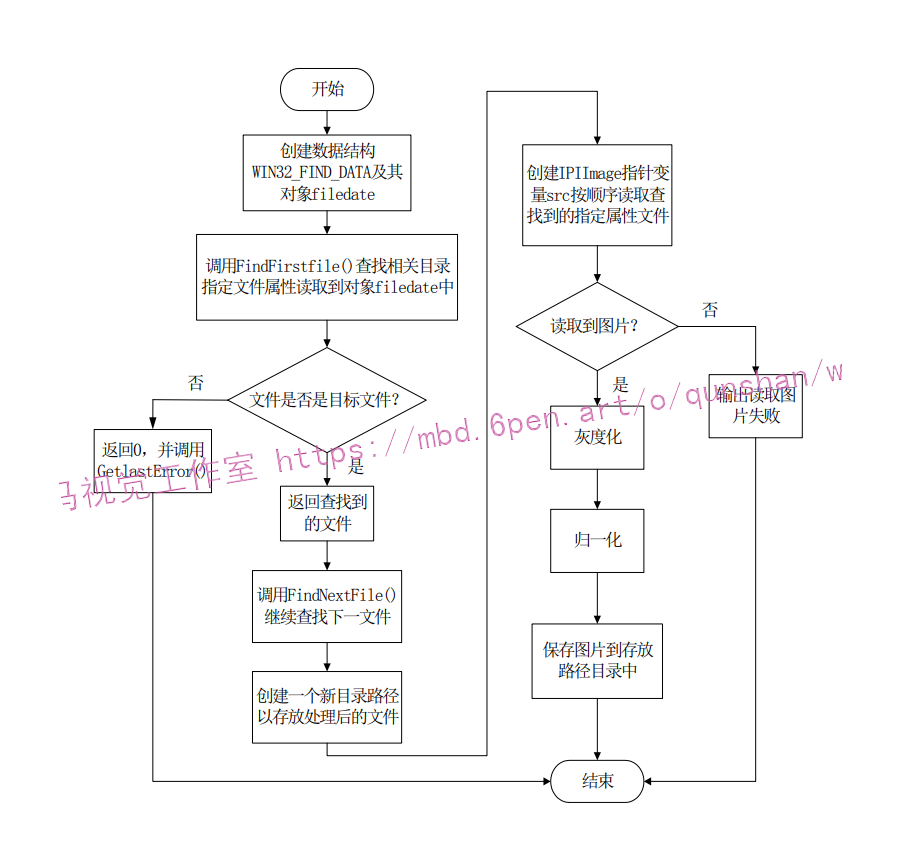
#### 代码实现
```
#!/usr/bin/perl
use File::Basename;
use strict;
##########################################################################
# Create samples from an image applying distortions repeatedly 
# (create many many samples from many images applying distortions)
#
#  perl createtrainsamples.pl <positives.dat> <negatives.dat> <vec_output_dir>
#      [<totalnum = 7000>] [<createsample_command_options = ./createsamples -w 20 -h 20...>]
#  ex) perl createtrainsamples.pl positives.dat negatives.dat samples
#
# Author: Naotoshi Seo
# Date  : 09/12/2008 Add <totalnum> and <createsample_command_options> options
# Date  : 06/02/2007
# Date  : 03/12/2006
#########################################################################
my $cmd = './createsamples -bgcolor 0 -bgthresh 0 -maxxangle 1.1 -maxyangle 1.1 maxzangle 0.5 -maxidev 40 -w 20 -h 20';
my $totalnum = 7000;
my $tmpfile  = 'tmp';

if ($#ARGV < 2) {
    print "Usage: perl createtrainsamples.pl\n";
    print "  <positives_collection_filename>\n";
    print "  <negatives_collection_filename>\n";
    print "  <output_dirname>\n";
    print "  [<totalnum = " . $totalnum . ">]\n";
    print "  [<createsample_command_options = '" . $cmd . "'>]\n";
    exit;
}
my $positive  = $ARGV[0];
my $negative  = $ARGV[1];
my $outputdir = $ARGV[2];
$totalnum     = $ARGV[3] if ($#ARGV > 2);
$cmd          = $ARGV[4] if ($#ARGV > 3);

open(POSITIVE, "< $positive");
my @positives = <POSITIVE>;
close(POSITIVE);

open(NEGATIVE, "< $negative");
my @negatives = <NEGATIVE>;
close(NEGATIVE);

# number of generated images from one image so that total will be $totalnum
my $numfloor  = int($totalnum / $#positives);
my $numremain = $totalnum - $numfloor * $#positives;

# Get the directory name of positives
my $first = $positives[0];
my $last  = $positives[$#positives];
while ($first ne $last) {
    $first = dirname($first);
    $last  = dirname($last);
    if ( $first eq "" ) { last; }
}
my $imgdir = $first;
my $imgdirlen = length($first);

for (my $k = 0; $k < $#positives; $k++ ) {
    my $img = $positives[$k];
    my $num = ($k < $numremain) ? $numfloor + 1 : $numfloor;

    # Pick up negative images randomly
    my @localnegatives = ();
    for (my $i = 0; $i < $num; $i++) {
        my $ind = int(rand($#negatives));
        push(@localnegatives, $negatives[$ind]);
    }
    open(TMP, "> $tmpfile");
    print TMP @localnegatives;
    close(TMP);
    #system("cat $tmpfile");

    !chomp($img);
    my $vec = $outputdir . substr($img, $imgdirlen) . ".vec" ;
    print "$cmd -img $img -bg $tmpfile -vec $vec -num $num" . "\n";
    system("$cmd -img $img -bg $tmpfile -vec $vec -num $num");
}
unlink($tmpfile);
 ```

# 7.车辆测距
将摄像头安装在试验车后视镜位置上，固定校对好拍摄角度，获取实验车前方的道路信息。为了计算实验车辆与目标车辆的距离，建立如图所示的车距检测模型示意图。
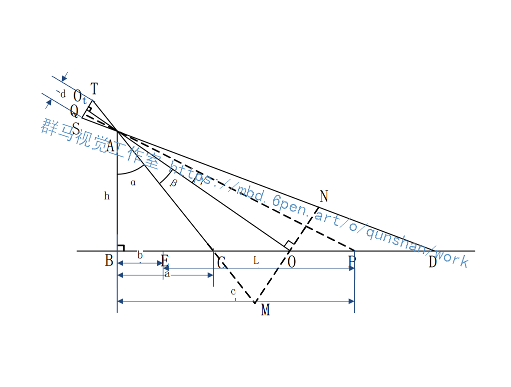
由图可以看出，在物坐标系中，点A为摄像头所在位置，点B是摄像头垂直方向与地面的交点，所以h表示摄像头安装位置距离地面的高度;点C和点D分别表示摄像头采集画面的最下边缘和最上边缘与地面的交点，所以长度α为摄像头采集画面的最下边缘与地面的交点C和摄像头垂直方向与地面的交点B之间的距离;实验车身前端垂直方向与地面的交点记为E，所以a为摄像头下视野与摄像头垂直方向的夹角，长度b为摄像头垂直方向与地面的交点B与实验车身前端垂直方向与地面的交点E之间的距离;
摄像头光轴所在直线与地面的交点记为О，前方目标车辆的位置记为P，所以角﹖是摄像头光轴所在直线与目标车辆和摄像头连线之间的夹角，长度c表示目标车辆所在位置与地面的交点Р和摄像头垂直方向与地面的交点B的距离，β为摄像头下视野与摄像头光轴所在方向的夹角，长度L为需要计算的实验车辆与目标车辆之间的距离。
根据成像的原理，摄像头拍摄图像的成像平面中，其中ST 的长度为图像的总高度d，可由摄像头的分辨率得到。点O既是像素坐标系中平面图像的中心点，又是图像坐标系的原点。由焦距的定义可得，点Ot到摄像头所在位置点A之间的距离即为相机的焦距f。又因为AO.是ST的中垂线，M、N分别为摄像机上下视野上的点，令MN垂直AO，可得AO也是MN的中垂线。P’是目标车辆在像坐标系的成像位置，点Q是P’的x轴方向延长线与像坐标系y轴的交点，所以QOt的长度为P’的y坐标减去O的y坐标，即 Py '-yt。本文中要计算的实验车辆与目标车辆之间的距离为:
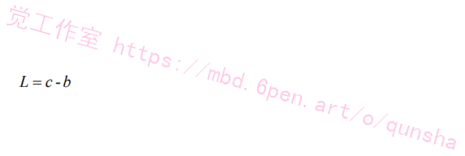
参数b可以在实验之前测量出来，所以只要计算出表示目标车辆所在位置与地面的交点Р和摄像头垂直方向与地面的交点B的距离c就可以得到实验车辆与目标车辆之间的距离L。
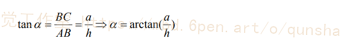
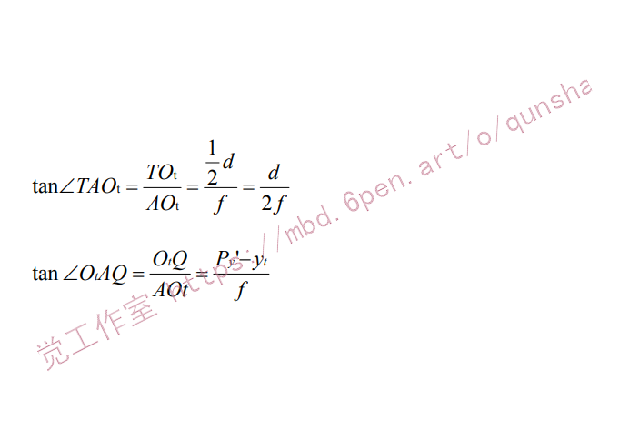
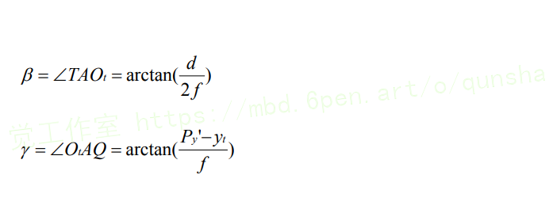
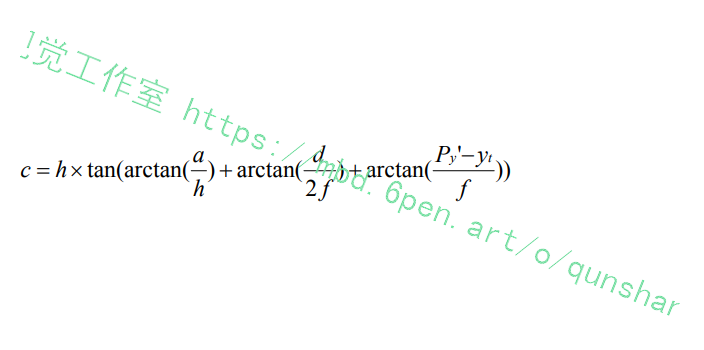
可知图像坐标系和像素坐标系都在成像平面上，但是两个坐标系的原点和坐标系的度量单位均不相同。要想计算出距离L，就要先将公式中的图像坐标Py'和y,的物理单位(mm)转换为像素坐标中像素点对应的像素(pixel)单位。转换过程中，lpixel = dx mm。

#### 代码实现
```
#!usr/bin/python
# -*- coding: utf-8 -*-
 
########利用三角形相似原理进行简单单目测距#########
# author：行歌
# email:1013007057@qq.com
 
import numpy as np
import cv2
 
# initialize the known distance from the camera to the object,
# which in this case is 24 inches
KNOWN_DISTANCE = 24.0
 
# initialize the known object width, which in this case,
# the piece of paper is 11 inches wide
KNOWN_WIDTH = 11.69
KNOWN_HEIGHT = 8.27
 
# initialize the list of images that we'll be using
IMAGE_PATHS = ["Picture1.jpg", "Picture2.jpg", "Picture3.jpg"]
 
 
def find_marker(image):
    gray_img = cv2.cvtColor(image, cv2.COLOR_BGR2GRAY)
    # 将彩色图转化为灰度图
 
    gray_img = cv2.GaussianBlur(gray_img, (5, 5), 0)
    # 高斯平滑去噪
 
    edged_img = cv2.Canny(gray_img, 35, 125)
    # Canny算子阈值化
    # cv2.imshow("edged_img",edged_img)
 
    img, countours, hierarchy = cv2.findContours(edged_img.copy(), cv2.RETR_LIST,cv2.CHAIN_APPROX_SIMPLE)
    # 注意，findcontours函数会“原地”修改输入的图像。opencv3会返回三个值,分别是img, countours, hierarchy
    # 第二个参数表示轮廓的检索模式,cv2.RETR_EXTERNAL表示只检测外轮廓；v2.RETR_LIST检测的轮廓不建立等级关系
    # cv2.RETR_CCOMP建立两个等级的轮廓；cv2.RETR_TREE建立一个等级树结构的轮廓。
    # 第三个参数method为轮廓的近似办法,cv2.CHAIN_APPROX_NONE存储所有的轮廓点，
    # 相邻的两个点的像素位置差不超过1，即max（abs（x1 - x2），abs（y2 - y1）） == 1
    # cv2.CHAIN_APPROX_SIMPLE压缩水平方向，垂直方向，对角线方向的元素，只保留该方向的终点坐标，
    # 例如一个矩形轮廓只需4个点来保存轮廓信息
 
    # cv2.drawContours(image,countours,-1,(0,0,255),2,8)
    # # 第三个参数指定绘制轮廓list中的哪条轮廓，如果是-1，则绘制其中的所有轮廓。
    #
    # cv2.imshow('image', image)
 
    # print(len(countours)),
    # 输出如下：15，即该图检测出15个轮廓
 
    c = max(countours, key = cv2.contourArea)
    # 提取最大面积矩形对应的点集
 
    rect = cv2.minAreaRect(c)
    # cv2.minAreaRect()函数返回矩形的中心点坐标，长宽，旋转角度[-90,0)，当矩形水平或竖直时均返回-90
    # c代表点集，返回rect[0]是最小外接矩形中心点坐标，
    # rect[1][0]是width，rect[1][1]是height，rect[2]是角度
 
 
    # box = cv2.boxPoints(rect)
    # # 但是要绘制这个矩形，我们需要矩形的4个顶点坐标box, 通过函数cv2.boxPoints()获得，
    # # 即得到box：[[x0, y0], [x1, y1], [x2, y2], [x3, y3]]
    # # print(box)，输出如下：
    # # [[508.09482  382.58597]
    # #  [101.76947  371.29916]
    # #  [109.783356  82.79956]
    # #  [516.1087    94.086365]]
    #
    # # 根据检测到的矩形的顶点坐标box，我们可以将这个矩形绘制出来，如下所示：
    # for i in range(len(box)):
    #     cv2.line(image, (box[i][0],box[i][1]),(box[(i+1)%4][0],box[(i+1)%4][1]),(0,0,255),2,8)
    # cv2.imshow('image', image)
 
    return rect
 
 
def distance_to_camera(knownWidth, focalLength, perWidth):
    return (knownWidth * focalLength) / perWidth
 
 
def calculate_focalDistance(img_path):
    first_image = cv2.imread(img_path)
    # cv2.imshow('first image',first_image)
 
    marker = find_marker(first_image)
    # 得到最小外接矩形的中心点坐标，长宽，旋转角度
    # 其中marker[1][0]是该矩形的宽度，单位为像素
 
    focalLength = (marker[1][0] * KNOWN_DISTANCE) / KNOWN_WIDTH
    # 获取摄像头的焦距
 
    print('焦距（focalLength ）= ',focalLength)
    # 将计算得到的焦距打印出来
 
    return focalLength
 
 
def calculate_Distance(image_path,focalLength_value):
    # 加载每一个图像的路径，读取照片，找到A4纸的轮廓
    # 然后计算A4纸到摄像头的距离
 
    image = cv2.imread(image_path)
    cv2.imshow("image", image)
    cv2.waitKey(300)
 
    marker = find_marker(image)
    distance_inches = distance_to_camera(KNOWN_WIDTH,focalLength_value, marker[1][0])
    # 计算得到目标物体到摄像头的距离，单位为英寸，
    # 注意，英寸与cm之间的单位换算为： 1英寸=2.54cm
 
    box = cv2.boxPoints(marker)
    # print( box )，输出类似如下：
    # [[508.09482  382.58597]
    #  [101.76947  371.29916]
    #  [109.783356 82.79956]
    #  [516.1087   94.086365]]
 
    box =np.int0( box)
    # 将box数组中的每个坐标值都从浮点型转换为整形
    # print( box )，输出类似如下：
    # [[508 382]
    #  [101 371]
    #  [109 82]
    #  [516 94]]
 
    cv2.drawContours(image, [box], -1, (0, 0, 255), 2)
    # 在原图上绘制出目标物体的轮廓
 
    cv2.putText(image, "%.2fcm" % (distance_inches * 2.54),
            (image.shape[1] - 300, image.shape[0] - 20), cv2.FONT_HERSHEY_SIMPLEX,
            2.0, (0, 0, 255), 3)
    # cv2.putText()函数可以在照片上添加文字
    # cv2.putText(img, txt, (int(x),int(y)), fontFace, fontSize, fontColor, fontThickness)
    # 各参即为：照片/添加的文字/左上角坐标/字体/字体大小/颜色/字体粗细
 
    cv2.imshow("image", image)
 
 
 
 
 
if __name__ == "__main__":
    img_path = "Picture1.jpg"
    focalLength = calculate_focalDistance(img_path)
    # 获得摄像头焦
 
    for image_path in IMAGE_PATHS:
        calculate_Distance(image_path,focalLength)
        cv2.waitKey(1000)
    cv2.destroyAllWindows()
 ```

# 8.系统整合
下图[源码＆环境部署视频教程＆数据集＆自定义UI界面](https://s.xiaocichang.com/s/3936d6) 
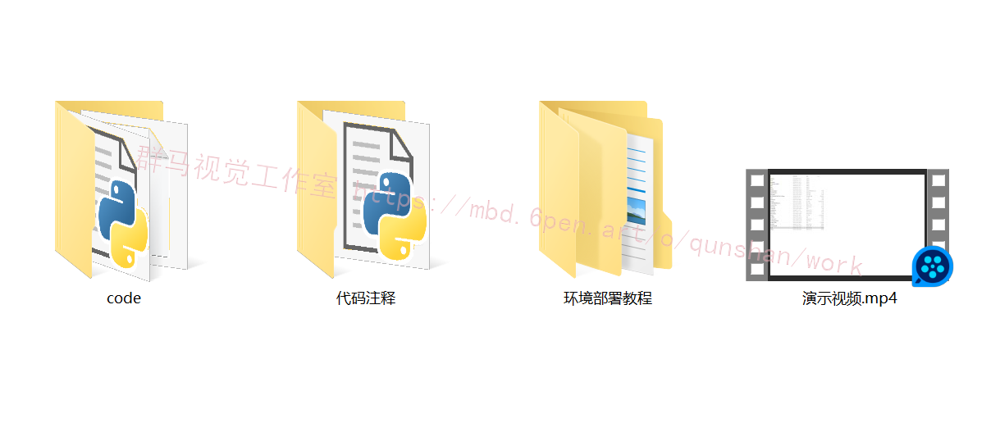

参考[博客《基于Opencv的车距检测系统（源码＆教程）》](https://mbd.pub/o/qunma/work)


# 9.参考文献
[1]中国汽车工业协会.2018年中国汽车产销量情况分析及行业发展趋势预测[EB/OL].
http://www.chyxx.com/industry/201807/662384.htm, 2018-07-25.
[2]张懿，刘焰.大数据时代下的智能网联汽车发展研究[J.江苏科技信息, 2016,(24):
7-9.
[3]郁捷安.智能网联汽车解读[J.时代汽车, 2019,(O1): 184-187.[4]智车科技.中国智能网联汽车产业发展报告[EB/OL].
http://www.elecfans.com/d/832963.html, 2018-12-17.
[5]李克强,王跃建,高峰,张磊.基于ITS技术的汽车驾驶安全辅助系统[C].2006中国
汽车安全技术国际研讨会, 2006:32-35.
[6]白侏，周艮.汽车雷达应用系统的行人标准物标及其雷达截面测量[J].汽车安全与
节能学报, 2013,(3): 223-227.
[7]镜头观察．车载摄像头市场现状及趋势[EB/OL].
https://www.sohu.com/a/234390687_100182354,2018-06-07.
[8]刘赟,周爽.人工智能与计算机视觉产业发展[J.现代商业, 2017,(24): 20-21.[9]陆志伟，王明革,赵瑞海．计算机视觉技术的研究与应用[J].数字技术与应用,
2016,(03): 109.
[10]陈丹.计算机视觉技术的发展及应用[J].电脑知识与技术, 2008,(35): 2449-2452.[11]周欣.汽车辅助驾驶系统中的计算机视觉技术[D].重庆:重庆大学, 2000.
[12]孙冰.“百度大脑”思考无人车的未来[J.中国经济周刊, 2016(37): 64-65.
[13]廖传锦,秦小虎,黄席樾．以人为中心的汽车主动安全技术综述[J.计算机仿真，
2004,21(9):152-156.
[14]Zelinsky A. Learning OpenCV-Computer Vision with the OpenCV Library[J]. Robotics
and Automation Magazine,IEEE.2009,16(3): 100-101.
[15]陈胜勇，刘盛.基于OpenCV的计算机视觉技术实现[M].北京:科学出版社, 2008.
[16]陈胜勇,刘盛等.基于OpenCV的计算机视觉技术实现[M].北京:科学出版社,2008.
[17]刘瑞祯，于仕棋. OpenCV教程[M].北京:北京航空航天出版社, 2007.


---
#### 如果您需要更详细的【源码和环境部署教程】，除了通过【系统整合】小节的链接获取之外，还可以通过邮箱以下途径获取:
#### 1.请先在GitHub上为该项目点赞（Star），编辑一封邮件，附上点赞的截图、项目的中文描述概述（About）以及您的用途需求，发送到我们的邮箱
#### sharecode@yeah.net
#### 2.我们收到邮件后会定期根据邮件的接收顺序将【完整源码和环境部署教程】发送到您的邮箱。
#### 【免责声明】本文来源于用户投稿，如果侵犯任何第三方的合法权益，可通过邮箱联系删除。